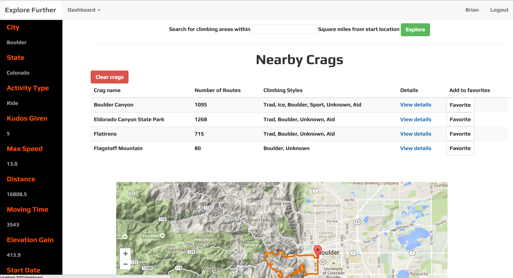

# Explore further

#### A Rails app that allows Strava fitness users to explore rock climbing areas within a dynamic vicinity of any outdoor activity associated with their account. Consumes three APIs and serves one. Google Maps integration.

[Hosted here](http://explore-further.herokuapp.com)

Repo: http://github.com/brianrip/explore_further

### Indivual Project
__Stack:__

- Ruby, Rails, Javascipt, ActiveRecord, OAuth, RSpec

